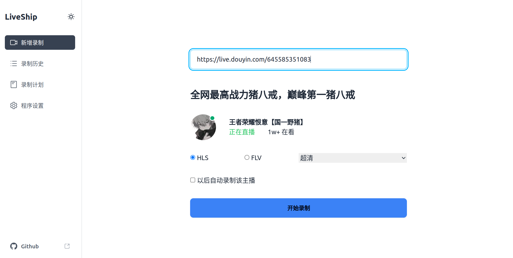
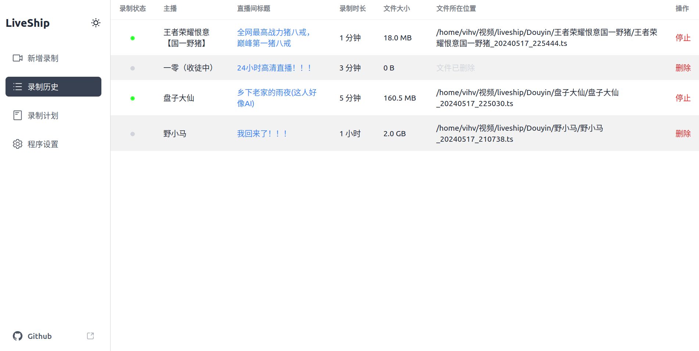

## 简介

liveship 是一个小巧易用的直播录制工具，目前已支持抖音，未来计划添加更多平台支持。

## 运行截图

## 工作原理

liveship 本质上只是 ffmpeg 套壳，通过模拟请求获取直播流地址，然后使用 ffmpeg 进行录制。因此要求您的电脑上必须安装有 ffmpeg，并在“程序设置”页面指定 ffmpeg 路径。

## 技术栈

自豪的使用 rust 和 svelte 5 构建。

## 使用方法

从 [release](https://github.com/jlvihv/liveship/releases/) 页面下载对应平台的二进制文件，然后运行即可。在 linux 和 macos 上，您可能需要先给二进制文件添加可执行权限。在 windows 上，应该可以直接双击运行。

liveship 不是桌面应用程序，而是一个 webui，程序运行之后，打开浏览器访问 [http://localhost:5577](http://localhost:5577) 即可开始使用。

## 特别鸣谢

直播源解析的代码很大程度上参考了 [DouyinLiveRecorder](https://github.com/ihmily/DouyinLiveRecorder) 项目，在此致以诚挚的感谢。

## 特别说明

liveship 计划在 1.0 版本之后添加收费功能，作为我独立开发人生道路的探索。但在 1.0 之前，所有功能都是开源免费的，期待您的建议和反馈。

## License

CC BY-NC (Creative Commons Attribution-NonCommercial):

允许复制、发行、展示和表演作品及其衍生作品，但仅限于非商业用途。
