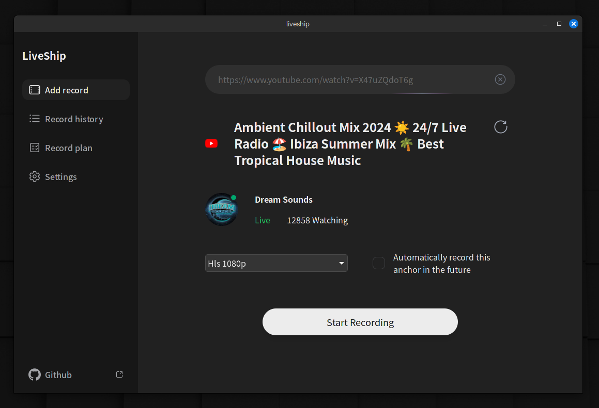

[中文](README.zh.md)

## Introduction

liveship is a compact and user-friendly live stream recording tool that captures live streams as video files. It is a cross-platform desktop application that supports Windows, macOS, and Linux systems.



## How It Works

liveship essentially acts as a wrapper for ffmpeg. It simulates requests to obtain live stream URLs and then uses ffmpeg to record them. If ffmpeg is not installed on your computer, liveship can automatically download it for you.

## Supported Websites

- [x] youtube
- [x] tiktok
- [x] twitch
- [x] Douyin
- [x] Huya
- [x] Xiaohongshu
- [] More platforms are in development.

## Tech Stack

Proudly built with Rust, Tauri, and Svelte 5.

## Usage

liveship is a Tauri-based desktop application. You can download the binary files for your platform from the [release](https://github.com/jlvihv/liveship/releases/) page, then install and run it.

After running the application, enter the live stream URL in the input box and click the "Start Recording" button.

## Example Live Stream URLs

```shell
# youtube
https://www.youtube.com/watch?v=waoLuUuC7yU

# tiktok
https://www.tiktok.com/@inhawlee12/live

# twitch
https://www.twitch.tv/kriss_drummer

# Douyin
https://live.douyin.com/790601393533

# Huya
https://www.huya.com/kpl

# Xiaohongshu
https://www.xiaohongshu.com/hina/livestream/569261361743261994?timestamp=1718371092456&share_source=&share_source_id=null&source=share_out_of_app&host_id=5c878d39000000001202d5e0&xhsshare=WeixinSession&appuid=5ed89960000000000101fdef&apptime=1718371092&share_id=da64276193b44a2ba85bda5c6fba5016
```

## FAQ

1. macOS prompts "The file is damaged and cannot be opened": This is because macOS restricts applications not from the App Store. You can remove the restriction by running the command `sudo xattr -d com.apple.quarantine /Applications/liveship.app` in the terminal.

## Special Thanks

The code for live stream parsing largely references the [DouyinLiveRecorder](https://github.com/ihmily/DouyinLiveRecorder) project. We extend our sincere thanks for their work.

## Special Note

liveship plans to introduce paid features after version 1.0 as part of my journey as an independent developer. However, all features will be open-source and free before version 1.0. Your suggestions and feedback are highly appreciated.

## License

CC BY-NC (Creative Commons Attribution-NonCommercial):

Allows copying, distribution, display, and performance of the work and its derivative works, but only for non-commercial purposes.
