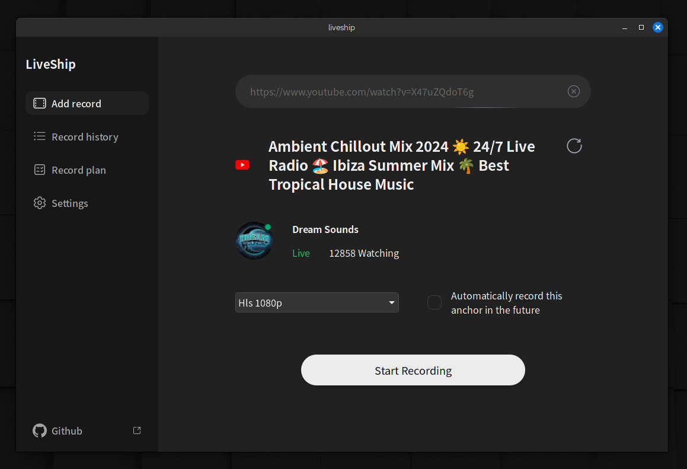

[English](README.md)

## 简介

liveship 是一个小巧易用的直播录制工具，用于将直播流录制为视频文件。这是一个跨平台桌面应用程序，支持 windows、mac os 和 linux 系统。



## 工作原理

liveship 本质上只是 ffmpeg 套壳，通过模拟请求获取直播流地址，然后使用 ffmpeg 进行录制。如果您的电脑上没有 ffmpeg，liveship 可以自动为您下载。

## 支持平台

- [x] 抖音
- [x] 虎牙
- [x] 小红书
- [x] youtube
- [x] tiktok
- [x] twitch
- [] 更多平台正在开发中

## 技术栈

自豪的使用 rust、tauri 和 svelte 5 构建。

## 使用方法

liveship 是一个基于 tauri 的桌面应用程序，您可以从 [release](https://github.com/jlvihv/liveship/releases/) 页面下载对应平台的二进制文件，然后安装运行。

运行后，在输入框中输入直播间链接，然后点击“开始录制”按钮即可。

## 直播间链接示例

```shell
# 抖音
https://live.douyin.com/790601393533

# 虎牙
https://www.huya.com/kpl

# 小红书
https://www.xiaohongshu.com/hina/livestream/569261361743261994?timestamp=1718371092456&share_source=&share_source_id=null&source=share_out_of_app&host_id=5c878d39000000001202d5e0&xhsshare=WeixinSession&appuid=5ed89960000000000101fdef&apptime=1718371092&share_id=da64276193b44a2ba85bda5c6fba5016

# youtube
https://www.youtube.com/watch?v=waoLuUuC7yU

# tiktok
https://www.tiktok.com/@inhawlee12/live

# twitch
https://www.twitch.tv/kriss_drummer
```

## 常见问题

1. mac os 提示“文件已损坏，无法打开”：这是因为 mac os 限制了非 app store 的应用程序，您可以在终端中执行 `sudo xattr -d com.apple.quarantine /Applications/liveship.app` 命令解除限制。

## 特别鸣谢

直播源解析的代码很大程度上参考了 [DouyinLiveRecorder](https://github.com/ihmily/DouyinLiveRecorder) 项目，在此致以诚挚的感谢。

## 特别说明

liveship 计划在 1.0 版本之后添加收费功能，作为我独立开发人生道路的探索。但在 1.0 之前，所有功能都是开源免费的，期待您的建议和反馈。

## License

CC BY-NC (Creative Commons Attribution-NonCommercial):

允许复制、发行、展示和表演作品及其衍生作品，但仅限于非商业用途。
